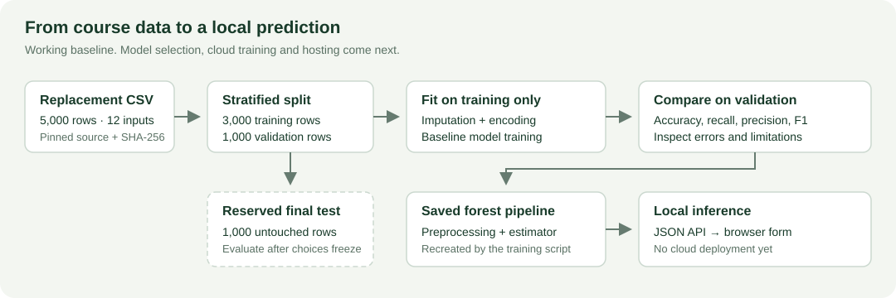
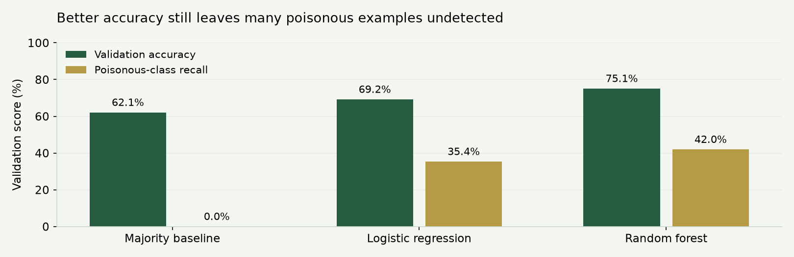

# CloudAI

**The best DL group in the world ever**

Team members: **Viviana Pajic · Tomislav Novosel · Muneeb Shakoor**

Shared starting point for our CloudAI project: a reproducible mushroom classification baseline, a local prediction interface and a proposed Citi Bike forecasting workflow. This is the baseline to review and extend together; it is not the final submission.

**Submission: 15 October 2026** · **Oral assessment: 23 October 2026**

| Dataset | Prediction question | Current state |
| --- | --- | --- |
| Mushrooms | Can the supplied features predict edible (`e`) or poisonous/unsafe (`p`)? | Audit and baseline models executed; local demo works |
| NYC Citi Bike | Can historical ride counts predict the next day's citywide total? | Proposed task and ingestion scaffold; data analysis pending |

## How it fits together



The replacement mushroom CSV is downloaded from the course repository and verified by SHA-256. We reserve 1,000 examples for final testing. Preprocessing is fitted only on training data, then saved together with the model so the browser uses the same transformations.

## Run the mushroom baseline

Use **Python 3.12**. The commands below are for PowerShell opened in this repository's root folder. Python 3.14 is not the verified project environment.

```powershell
py -3.12 -m venv .venv
.\.venv\Scripts\python.exe -m pip install -r requirements.txt
.\.venv\Scripts\python.exe src/mushrooms.py
.\.venv\Scripts\python.exe app/server.py
```

Open **http://127.0.0.1:8765**. Stop the server with **Ctrl+C**.

Training downloads the data and recreates the ignored `data/`, `models/` and generated `reports/` files. No saved model download is needed. This interface runs locally; cloud hosting and automated updates are later tasks.

To use the notebooks in VS Code, select `.venv\Scripts\python.exe` as their kernel and run them in numbered order. The PyCaret notebook uses a separate environment, described below.

## First results

**Validation only:** 3,000 training rows, 1,000 validation rows, 1,000 reserved test rows. Positive class: `p`. Decision threshold: `0.5`.

| Model | Accuracy | Poison recall | Poison precision | F1 |
| --- | ---: | ---: | ---: | ---: |
| Majority baseline | 62.1% | 0.0% | 0.0% | 0.000 |
| Logistic regression | 69.2% | 35.4% | 68.0% | 0.465 |
| Random forest | 75.1% | 42.0% | 84.6% | 0.561 |



The forest improves accuracy but misses **220 of 379 poisonous validation examples**. Accuracy alone therefore does not describe the result well. We still need to tune the models, investigate errors and choose the threshold using development data. The reserved test set has not been evaluated.

The current dataset contains **5,000 rows and 13 columns**, including the target. Use the teacher's replacement file, not the original UCI dataset. Its source and fingerprint are recorded in [SOURCE_DATASET_VERSION.json](SOURCE_DATASET_VERSION.json).

## Where to start

| File | Purpose | State |
| --- | --- | --- |
| [mushrooms/00_data_audit.ipynb](mushrooms/00_data_audit.ipynb) | Inspect types, missingness, labels and training-data distributions | Executed |
| [mushrooms/01_data_preparation.ipynb](mushrooms/01_data_preparation.ipynb) | Reproduce splits and preprocessing without exploratory graphs | Executed |
| [mushrooms/02_baseline_models.ipynb](mushrooms/02_baseline_models.ipynb) | Compare the dummy, logistic regression and forest; inspect errors | Executed |
| [mushrooms/03_automl_template.ipynb](mushrooms/03_automl_template.ipynb) | Start an automated comparison with the existing development split | Template; not executed |
| [citibike/00_proposed_task_and_ingestion.ipynb](citibike/00_proposed_task_and_ingestion.ipynb) | Define the proposed forecast and download/aggregate official archives | Template; not executed |
| [src/mushrooms.py](src/mushrooms.py) | Verified download, preprocessing, baseline training and export | Working baseline |
| [src/citibike.py](src/citibike.py) | Chunked archive ingestion and past-only daily features | Scaffold; real-data validation pending |
| [app/server.py](app/server.py), [app/index.html](app/index.html) | JSON inference API and browser interface | Local demo |
| [reports/mushroom_validation_metrics.csv](reports/mushroom_validation_metrics.csv) | Recorded baseline metrics, including the confusion-matrix counts | Validation snapshot |

Start by running the three mushroom notebooks and discussing the errors. Record actual names and changes in each notebook when taking ownership of a task.

## Continue the Citi Bike task

The proposed task predicts day `t` after the counts through `t−1` are available. Candidate inputs are calendar variables, yesterday's count, the count seven days earlier and the previous seven-day mean.

Before modelling:

1. Agree the NYC archive date range and fill `ARCHIVE_URLS` in the notebook using the [official source](https://citibikenyc.com/system-data).
2. Audit coverage, schemas, duplicates and timestamp handling before accepting the daily aggregates.
3. Investigate a testable weekly-pattern hypothesis with statistical evidence.
4. Confirm the prediction task, use chronological evaluation and compare against a seasonal-naive forecast using MAE/RMSE.

No Citi Bike data has been downloaded in this starter, and no forecasting results are claimed.

## Automated comparison

`03_automl_template.ipynb` is deliberately separate from the working baseline. Follow the lecturer's [PyCaret installation notebook](https://github.com/mjochen/CloudAI/blob/master/Exercises/3%20model%20quality/5.1%20-%20Install%20PyCaret.ipynb) and use an isolated compatible Python environment, such as Python 3.11. Do not install PyCaret into the verified Python 3.12 environment.

The template uses the development validation partition as PyCaret's `test_data`; it does **not** use our reserved final-test partition. Its preprocessing and class mapping still need review before interpreting its results.

## Work remaining

- Finish each dataset's analysis, statistical reasoning and final preparation.
- Run automated comparisons and tune additional models.
- Analyse errors and compare models on the same development splits.
- Train and tune on AWS, retaining the cloud notebook and evidence.
- Host inference and implement the agreed automatic model-update workflow.
- Freeze model choices, evaluate the reserved tests and prepare the presentation.

Assign tasks in the team meeting. Everyone should understand both datasets and the complete inference path, even when implementation is divided.

## Collaboration and provenance

Keep raw data, environments and model binaries out of commits. Preserve useful notebook outputs and explain choices beside the code. Make focused commits and review one another's changes.

The initial scaffold, notebook explanations and baseline were prepared with AI assistance. The scope, verification and representative requests are recorded in [docs/AI_USE.md](docs/AI_USE.md). Individual team reviews and contributions should be added as the project develops.

**Coursework only:** the mushroom data is hypothetical and noisy. The model score cannot establish whether a real mushroom is edible.

Course reference: [CloudAI assignment](https://github.com/mjochen/CloudAI/blob/master/Discussion%20topics/project%20assignment.md).
