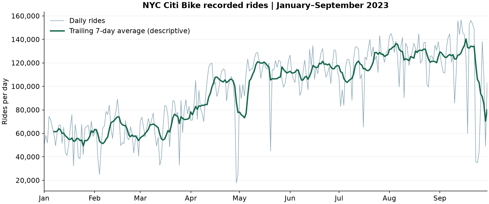
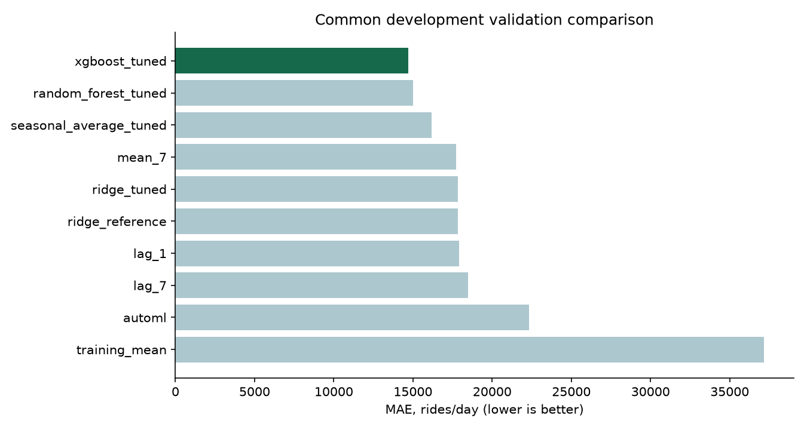

# CloudAI

**The best DL group in the world ever**

Viviana Pajic · Tomislav Novosel · Muneeb Shakoor

**Deadline: 15 October** · **Oral: 23 October**

## Running the project

For the current **Mushroom tasks 13, 15, 18 and 24**, use the separate Python 3.11
environment. From PowerShell:

```powershell
.\.venv-pycaret\Scripts\python.exe scripts/run_mushroom_notebooks.py
.\.venv-pycaret\Scripts\python.exe -m unittest discover -s tests -v
```

For a fresh checkout, first install Python 3.11, run `py -3.11 -m venv .venv-pycaret`,
then `.\.venv-pycaret\Scripts\python.exe -m pip install -r requirements-pycaret.lock.txt`.
The runner executes notebooks 01-04 with this exact interpreter. For interactive
use, choose `.venv-pycaret\Scripts\python.exe` as the notebook kernel.

See [the Mushroom workflow](docs/MUSHROOM_WORKFLOW.md) for commands, results,
provenance and the distinction between historical and current experiments.
Data and models stay out of Git and are recreated by the notebooks. The Python 3.12 `.venv` remains separate for Citi Bike. Install
`requirements-citibike.lock.txt` there for the new forecasting notebooks.
The existing local Mushroom demo uses the Python 3.11 environment and
`app/server.py`; its threshold remains the provisional reference value 0.5.

## What's in the folders?

| Folder | What's there |
|---|---|
| `mushrooms/` | Executed preparation, baselines, AutoML, error/threshold analysis and historical results |
| `citibike/` | Data, hypothesis, forecasting and model comparison notebooks |
| `src/` | Python helpers used by the notebooks |
| `app/` | Shared home page, mushroom classifier and Citi Bike forecast |
| `docs/` | More detailed explanations and the [AI assistance record](docs/AI_USE.md) |

## Mushrooms so far

We use the teacher's replacement dataset: **5,000 rows and 13 columns**. The source is recorded in [SOURCE_DATASET_VERSION.json](SOURCE_DATASET_VERSION.json).

**Tasks 13, 15, 18 and 24 - Muneeb Shakoor, with AI assistance.** The integration
builds on **Viviana Pajic's tasks 8/11** and the shared starter maintained by
**Tomislav Novosel**. Contributor responsibility does not imply independent
authorship of AI-generated code; see [the assistance record](docs/AI_USE.md).

The current preparation keeps all rows, drops the two noise columns, and fits
imputation/encoding within each training fold. Numeric missing indicators are
omitted following the existing development experiment. Extreme values and zeros
are retained because their validity cannot be settled from this dataset alone.
Missingness tests do not establish that data are missing completely at random.

The frozen [split manifest](mushrooms/split_manifest.json) preserves **4,000
development rows and 1,000 reserved final-test rows**. The common comparison uses
identical stratified five-fold splits repeated twice, with poisonous as class 1.
AP is average precision, not trapezoidal PR-AUC; AP/ROC-AUC below are mean fold
scores. Recall uses averaged held-out probabilities at the reference threshold 0.5.

| Model | Development AP | Development ROC-AUC | Poison recall at 0.5 |
|---|---:|---:|---:|
| Random forest | 0.783075 | 0.833420 | 0.520792 |
| Histogram gradient boosting | 0.758460 | 0.812080 | 0.536634 |
| Extra Trees | 0.754268 | 0.804034 | 0.482508 |
| Logistic regression | 0.630651 | 0.689445 | 0.345875 |
| Majority baseline | 0.378750 | 0.500000 | 0.000000 |

[Actual PyCaret screening](mushrooms/03_automl.ipynb) compared four complete
pipelines on 3,000 development training rows. RF ranked first (AP 0.763011).
The two additional families were then evaluated on the common 4,000-row folds
above. Screening scores and common-comparison scores are separate protocols;
this bounded run is not hyperparameter tuning or an exhaustive AutoML search.

[Error and threshold analysis](mushrooms/04_model_comparison.ipynb) includes
confusion matrices, identifiable poisonous-as-edible failures, missingness groups
and precision/recall trade-offs. At 0.5, RF misses **726/1,515 poisonous rows**.
Task 24 selects a provisional development policy maximizing specificity subject
to 90% calibration recall, and evaluates that procedure with separate outer
development folds. The target is a team modelling preference, not a safety
guarantee. The outer-fold policy achieves **89.24% recall, 49.82% precision**, with
**163 false negatives**. The single threshold selected afterwards from all
development OOF scores is **0.24693**; its independent performance is not yet
measured. See [threshold_run.json](reports/mushrooms/threshold_run.json).

Historical 3,000/1,000 validation results and Viviana's earlier threshold experiment
remain in the [historical baseline notebook](mushrooms/history/02_baseline_models_before_integration.ipynb),
[historical validation CSV](reports/mushroom_validation_metrics.csv) and
[tasks 8/11 notes](docs/MUSHROOM_TASKS_8_11.md). Protocol differences prevent direct
improvement claims. Four reduced-feature collision groups were retained;
development fold purging changed RF AP by only **+0.001371**.

**Tasks 20 and 21 - Viviana Pajic, with AI assistance.** Both models were tuned
with nested cross-validation on the same 4,000 development rows and folds as the
table above; see [the tuning notes](docs/MUSHROOM_TASKS_20_21.md).

| Model | Baseline AP | Tuned AP | Tuned ROC-AUC |
|---|---:|---:|---:|
| Logistic regression ([notebook 05](mushrooms/05_tune_logistic_regression.ipynb)) | 0.6307 | 0.6306 | 0.6896 |
| Random forest ([notebook 06](mushrooms/06_tune_random_forest.ipynb)) | 0.7831 | 0.7885 | 0.8412 |

Tuning does not help logistic regression, which underfits. The random forest
improves slightly with `max_features = 0.3`, ahead in 7 of 10 folds, and is the
leading candidate for task 28.

**The final test has not been evaluated.** Final model selection and the
remaining project work are still pending. Development results do not establish
real-world mushroom edibility.


## Citi Bike so far

**Tasks 7 and 9 - Tomislav.** We downloaded and checked the 2023 NYC data, then counted rides by their start date. We also needed January 2024 because it contains **410 rides that started in December 2023**.

The daily table has **35,107,120 rides across all 365 days of 2023**. We found no duplicate ride IDs or missing dates.

```powershell
.\.venv\Scripts\python.exe src/citibike.py
```

The first run downloads about 2 GB. Start with [notebook 00](citibike/00_data_acquisition.ipynb), then [notebook 01](citibike/01_data_audit.ipynb). Their outputs are already saved.



What we noticed:

- Average daily rides rise from about **58,000 in January** to **128,000 in August**.
- Wednesdays average about **107,000 rides**, compared with **84,000 on Sundays**.
- Recent counts and the count from a week earlier look useful to investigate.
- Some days have big drops, so weekday alone won't explain everything.

This makes the calendar and recent ride counts a reasonable starting point for predicting the next day's total. Seasons and people's routines might explain some of the patterns, but we haven't established why they happen or how well a model will predict them.

**Task 10 - Tomislav.** We compared weekday and weekend averages within **38 complete weeks**. Weekdays were busier in **31 of those weeks**, with an average gap of about **13,467 rides per day**. The uncertainty checks support a weekly pattern in these data, so weekday information is worth trying in the forecast.

This is exploratory because we had already looked at the data. It does not tell us how accurate a forecast will be. See [notebook 02](citibike/02_weekly_hypothesis.ipynb) and [the task 10 notes](docs/CITIBIKE_TASK_10.md) for the test, results and limits. Use the same Python 3.12 environment as notebooks 00 and 01.

**9 October update - Tomislav.** The forecast predicts tomorrow's citywide rides from the previous 28 daily totals and calendar information. We train and tune on January-June, compare on July-September, and keep October-December for the final test.

We tried simple guesses, FLAML AutoML, Ridge, random forest and XGBoost. The XGBoost search ran **192 configurations on BESTIJA's RTX 5080**. Its validation MAE was about **14,693 rides/day**, compared with **18,477** for last week's count - **20.5% less error**. It still makes big mistakes on sudden quiet days, so this is our local candidate rather than the final model.



Notebooks **03-10** explain preparation, baselines, model searches and errors. The actual experiment results are saved; notebook 11 is an **unrun AWS preparation**. See [the forecasting notes](docs/CITIBIKE_WORKFLOW.md) for the results and commands.

Both prediction pages now share one local app. On BESTIJA, run:

```powershell
.\.venv\Scripts\python.exe scripts/run_local_app.py
```

Open **http://127.0.0.1:8780** on the desktop. A fresh clone needs the two environments and model rebuilds described in [the app setup notes](docs/DEPLOYMENT.md). A GitHub workflow rebuilds and checks the Citi Bike candidate on CPU. AWS training, public hosting, automatic deployment and final-test scoring still need finishing.

## Tasks

### Planning

- [x] **01. Confirm requirements and dates.**
- [x] **02. Complete repository access and review the starter.**
- [x] **03. Check everyone's environment** - local Mushroom/PyCaret and Citi Bike environments verified; the fresh release check remains in task 33.
- [x] **04. Agree scope and responsibilities.**
- [ ] **05. Check AWS and hosting access** - access, costs and cloud requirements.

### Sprint 1 - 6-8 October

- [x] **06. Check the replacement mushroom dataset.**
- [x] **07. Download and assemble Citi Bike data - Tomislav.**
- [x] **08. Explore mushroom data - Viviana.**
- [x] **09. Explore and aggregate Citi Bike data - Tomislav.**
- [x] **10. Test the Citi Bike hypothesis - Tomislav.** Weekly contrast, uncertainty checks and exploratory conclusion; [notebook](citibike/02_weekly_hypothesis.ipynb).
- [x] **11. Define mushroom evaluation - Viviana.**
- [x] **12. Define Citi Bike evaluation - Tomislav.** Fixed chronological splits and one-day horizon.
- [x] **13. Finish mushroom preparation - Muneeb Shakoor.** Frozen split, ten-feature contract and fold-safe preparation; [executed notebook](mushrooms/01_data_preparation.ipynb).
- [x] **14. Finish Citi Bike preparation - Tomislav.** Features use only earlier ride counts.
- [x] **15. Reproduce mushroom baselines - Muneeb Shakoor.** Consistent development folds, metrics and historical traceability; [executed notebook](mushrooms/02_baseline_models.ipynb).
- [x] **16. Build Citi Bike baselines - Tomislav.** Weekly, recent average and stronger seasonal comparisons.
- [x] **17. Connect both models to the local app - Tomislav.** Two isolated runtimes behind one home page.

### Sprint 2 - 9-11 October

- [x] **18. Run mushroom AutoML comparison - Muneeb Shakoor.** Executed bounded PyCaret screening and common-fold candidate comparison; [notebook](mushrooms/03_automl.ipynb).
- [x] **19. Run Citi Bike AutoML comparison - Tomislav.** FLAML, four families, 80 trials.
- [x] **20. Tune mushroom model 1 - Viviana.**
- [x] **21. Tune mushroom model 2 - Viviana.**
- [x] **22. Tune Citi Bike model 1 - Tomislav.** Ridge, 28 configurations.
- [x] **23. Tune Citi Bike model 2 - Tomislav.** GPU XGBoost, 192 configurations; extra forest comparison.
- [x] **24. Investigate mushroom errors and choose a threshold - Muneeb Shakoor.** Confusion matrices, missingness groups, false negatives and separately evaluated development threshold policy; [notebook](mushrooms/04_model_comparison.ipynb).
- [x] **25. Investigate Citi Bike errors and improve features - Tomislav.** Largest errors, groups and compact/full feature check.
- [ ] **26. Train and tune a mushroom model on AWS.**
- [ ] **27. Confirm or complete Citi Bike AWS training - Tomislav.** Notebook/script prepared; access and actual cloud run pending.
- [ ] **28. Choose the final models.** Citi Bike local candidate chosen; AWS comparison and mushroom choice remain open.
- [ ] **29. Host the app** - start once both prediction paths work.

### Sprint 3 - 12-14 October

- [ ] **30. Automate model updates and deployment.** Citi Bike CPU rebuild/check workflow added; hosting deployment still missing.
- [ ] **31. Evaluate the final models on the reserved test sets.** Keep them unscored until final choices are frozen.
- [ ] **32. Finish notebooks and documentation.** Local Citi Bike notebooks complete; AWS and final release notes pending.
- [ ] **33. Check the complete project from a fresh environment.** Local Citi Bike CPU rebuild checked; team and hosted release review remain.
- [ ] **34. Prepare the presentation and demo.**
- [ ] **35. Submit the repository link through Canvas.**

### Before the oral - 16-22 October

- [ ] **36. Review each other's notebooks.**
- [ ] **37. Practise the demo and questions.**
- [ ] **38. Check hosting and restart instructions for the assessment.**

Aim to finish on **14 October**, leaving a day for submission and fixes. Everyone should be able to explain both datasets.

Course assignment: [CloudAI project](https://github.com/mjochen/CloudAI/blob/master/Discussion%20topics/project%20assignment.md).

The starter and these notebooks were prepared with AI assistance; details are in [docs/AI_USE.md](docs/AI_USE.md). The mushroom dataset is coursework data; its predictions cannot establish whether a real mushroom is edible.
