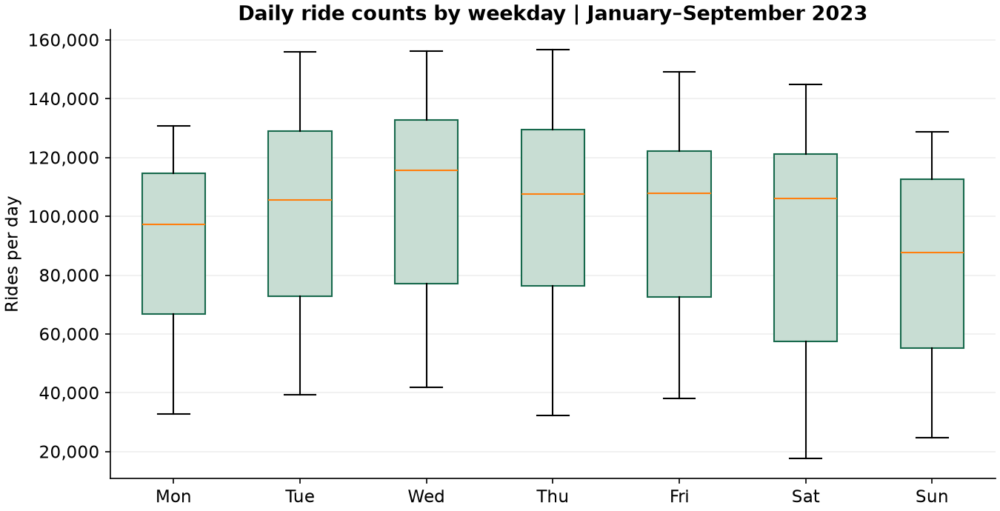
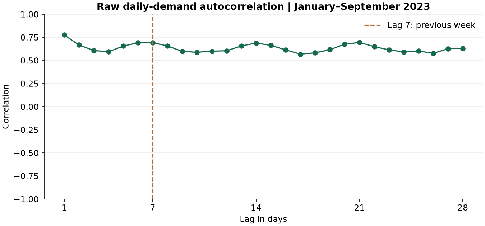

# Citi Bike: acquisition and exploration

**Owner: Tomislav Novosel.** Tasks 7 and 9 were implemented and executed on
6 October and prepared for the team's 7 October update. The working scope is
2023 NYC ride starts. The code and initial explanations were prepared with AI
assistance; the [assistance record](AI_USE.md) describes that work. Team review
and subsequent contributions should be recorded as the project develops.

## What these tasks achieve

**Task 7 makes the data reproducible.** A teammate should be able to run the
notebook and obtain the same source files and daily counts. The task therefore
includes downloading, opening every file, recording versions and checking that
the assembled records reconcile. Manually downloading a CSV and uploading it to
GitHub would leave those steps unexplained and difficult to reproduce.

**Task 9 determines what the data can tell us.** Before training a model, we
check for missing records, repeated rides, inconsistent schemas and unusual
observations. We then aggregate trips into daily counts and describe how those
counts change. This supplies the evidence and questions for task 10's hypothesis
test, and the input table for later forecasting.

Our proposed question is: **can historical usage help predict the number of
recorded NYC rides starting on the next day?** That remains a proposal for team
agreement. These notebooks do not train a model or complete the hypothesis test.

## Task 7: sources, versions and assembly

The sources are the [official Citi Bike histories](https://citibikenyc.com/system-data):

- [2023 annual archive](https://s3.amazonaws.com/tripdata/2023-citibike-tripdata.zip).
- [January 2024 boundary archive](https://s3.amazonaws.com/tripdata/202401-citibike-tripdata.zip).

We use a complete historical year to include different seasons. Separate Jersey
City `JC-*` files are outside this working scope. The two downloads total about
1.97 GB in decimal units, and remain in ignored `data/raw/citibike/`.

The annual ZIP contains monthly ZIPs, which in turn contain multiple CSVs.
January 2024 contains direct CSVs. The reader supports both structures and
processes every relevant CSV without extracting archive paths into the project.
It skips macOS metadata files. Large CSVs are read in chunks of 200,000 rows.
The complete trip table is never assembled in memory; exact ride identifiers
are retained separately for the global duplicate check.

The file fingerprints are pinned in `citibike/source_config.json`. SHA-256 is
a fingerprint of the downloaded bytes: a different file is rejected even if
it has the same name. It establishes reproducibility, not a guarantee that
every source record is correct. The manifest also records HTTP version metadata,
CSV names, row counts, timestamp coverage, column schemas and ZIP CRCs.

The executed controls are:

| Check | Result |
|---|---:|
| Downloaded archives | 2 |
| CSV files read | 42 |
| Different column schemas | 1 |
| Columns in that schema | 13 |
| All downloaded source records | 36,995,071 |
| Rides starting within 2023 | 35,107,120 |
| Starts outside the selected year | 1,887,951 |
| Dates in the accepted daily table | 365 |
| Missing calendar dates | 0 |
| Extra rows with repeated ride IDs | 0 |
| Unparsed start timestamps | 0 |

The reconciliation is exact:

`36,995,071 raw records = 35,107,120 counted starts + 1,887,951 out-of-year starts`.

The final table has two columns, `date` and `trips`. For example, 2023-01-01
has 50,642 recorded starts. Grouping all accepted starts by their printed date
produces this count; summing those daily counts reproduces the accepted total.

### Why the adjacent January archive matters

The inspection found **6,888 starts outside the month in their filename**,
while every end timestamp fell in the filename month. This is evidence that
these particular source versions are organized by ending month. We therefore
select and aggregate actual start dates rather than assuming file labels
identify the start period.

The annual archive includes 276 starts from December 2022, which we exclude
from a 2023-start target. Conversely, January 2024 provides **410 additional
starts from December 2023**, which we include. Downloading only the annual
file would miss those year-end starts.

Very long rides ending after January 2024 could still be absent. This boundary
limitation is documented rather than claiming a complete census of all rides.
The archive snapshots themselves may also contain corrections or unpublished
records; observed calendar coverage cannot establish completeness of all usage.

## Task 9: quality decisions

**Duplicates:** ride ID is checked across all chunks, files and both archives.
Every ID in these sources is a 16-digit hexadecimal value. Its exact unsigned
64-bit representation can be sorted without losing precision. Adjacent equal
values reveal duplicate IDs. We found none. If repetitions appear in a future
source, the pipeline stops for investigation rather than silently removing or
counting them. Unique IDs also rule out exact repeated rows including the ID.

**Missing dates:** every expected 2023 date has records. A missing date would
stop acceptance; it would not automatically become a zero-rides day. A zero
is an observed value, while absent source coverage is an unknown value.

**Missing fields:** 19,358 source rows lack start-station details and 105,412
lack end-station details. These counts describe all downloaded rows, including
January 2024. Such omissions do not prevent assigning a valid ride start to a
date. We retain the rows for daily counts. A station-level model would need a
different policy because its station target or inputs would be missing.

**Unusual durations:** the source includes 324 negative printed clock durations,
71 nonnegative durations below 60 seconds and 27,247 durations above 24 hours.
These flags overlap with other quality categories and must not be summed as
independent exclusions. They are diagnostic counts, not additional dropped rows.
We are counting recorded starts, so an unusual end timestamp does not by itself
invalidate an otherwise identifiable start. A duration model would need to
investigate them much more closely.

**Time interpretation:** the timestamps have no UTC offsets. We explicitly
interpret their printed dates as New York local clock dates, without converting
to UTC. This is an assumption to retain and confirm for any later hourly task.
There are 2,921 starts in the repeated autumn DST clock hour and none in the
nonexistent spring clock hour. Printed clock durations around DST can be
ambiguous. Daily counts keep each ride on its printed date; they do not assume
every local day contains exactly 24 hours.

**Unusual daily counts:** a simple whole-development-period IQR screen flags
no days, but the timeline still has pronounced dips. This illustrates why a
single distribution-based rule can miss unusual dates in a changing series.
We display the highest and lowest dates and retain them. A low count could
reflect a real disruption, holiday or weather event; this dataset alone does
not establish its cause.

## What the exploratory plots show

All substantive demand plots and summaries use **January–September 2023**:
273 dates and 26,360,785 rides. October–December is set aside as a candidate
test period; the team must still agree the final evaluation design in task 12.
Whole-source quality checks are kept separate from these exploratory findings.


Average daily volume rises from approximately **57,914 in January** to
**127,878 in August**, then is approximately **115,722 in September**. This
shows a changing level within the observed period. One year cannot establish
that the same seasonal pattern reliably repeats across years, and the graph
does not establish whether weather, network growth or other factors caused it.

The seven-day line smooths daily fluctuations. It includes the plotted day
and is suitable for retrospective exploration. A prediction feature must
instead use counts available before the predicted day; the existing helper
shifts before computing a rolling average.



Wednesday averages approximately **107,029 rides**, compared with **83,884 on
Sunday**. Each weekday has 39 observations in the exploratory window. Each
box contains the middle half of its daily counts, and its line is the median.
The wide spreads show that knowing the weekday does not explain every date.
This association is descriptive; it is not yet a significance result.

The lowest observed development date is **29 April: 17,757 rides**. The highest
is **14 September: 156,602 rides**. We have not attributed either to a specific
event without checking additional sources.



Raw correlation with the previous day is about **0.776** and with the day seven
days earlier about **0.693**. This motivates investigating recent history and
a last-week baseline. The changing level also contributes to these correlations,
so they cannot by themselves prove an independent weekly effect or good
forecast accuracy. Statistical testing belongs to task 10's separate update;
the held-out prediction comparison also remains a later task.

### Our working interpretation

The data give us a usable daily series: every date is present, the ride IDs
are unique and the totals reconcile. That is a good starting point for daily
forecasting, although it does not prove that the published source captured
every ride.

The summer rise and weekday differences suggest trying calendar information
alongside recent ride counts. Seasonal conditions or different weekday routines
could explain some of these patterns, but that is an interpretation to investigate,
not a cause established by the records. We should first examine the weekly
hypothesis, then check whether a model improves on repeating last week's count.

The sharp dips also matter. We retain them because a model that works only on
ordinary days would miss part of the problem. For now, we can describe those
dates; we have not verified what caused them. These tasks establish the data
and questions for modelling, rather than a finished forecast.

## Run and explain the work

From PowerShell in the repository root, using the existing project environment:

```powershell
.\.venv\Scripts\python.exe src/citibike.py
```

That downloads any missing archive, verifies the pinned fingerprints, audits
the rows and writes `data/processed/citibike_daily.csv` plus
`reports/citibike/audit.json`. A matching completed audit can be reused; from
Python, `acquire_and_audit(reuse_audit=False)` forces a fresh full row audit.
The cache verifies source and output fingerprints before reuse.

Then run the notebooks in order, selecting the Python 3.12 project kernel:

1. `citibike/00_data_acquisition.ipynb`: sources, streaming, reconciliation,
   member inventory and versioned `archive_manifest.json`.
2. `citibike/01_data_audit.ipynb`: quality decisions, plots, extreme dates and
   versioned `eda_summary.json`.

The first run downloads about 1.97 GB and scans nearly 37 million rows. Allow
several minutes and enough disk space for the cached archives and temporary
nested monthly files. Notebook outputs and figures are small enough to commit;
the raw archives, generated data and environments stay ignored.

Useful explanations for Friday:

- “Task 7 gets everyone the same data through code, with recorded versions.”
- “Task 9 checks whether our daily counts are credible before we model them.”
- “We count starts, so archive ending-month boundaries needed attention.”
- “We retain missing station details because our target is citywide usage.”
- “A visible weekday difference suggests a hypothesis; it does not prove it.”
- “The table measures recorded rides, not unmet demand for unavailable bikes.”

Next, review the 2023 scope with the team, complete the weekly-pattern test
(task 10), fix chronological evaluation (12), and prepare features and baselines
(14 and 16). The small number of daily observations is a limitation for complex
models; more historical years can be added if the team decides they are needed.

The historical archives are not a live daily feed. A future application that
uses yesterday's ride count must define how that count becomes available
before its forecast; archived monthly publication alone does not supply it.
