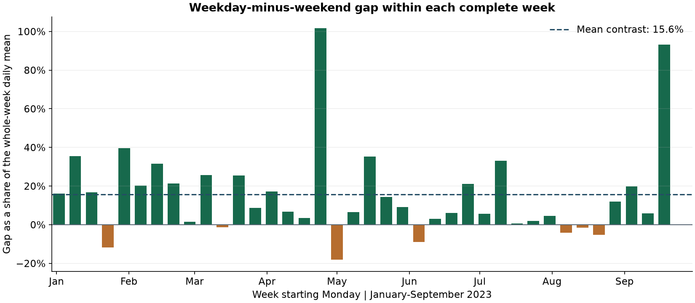
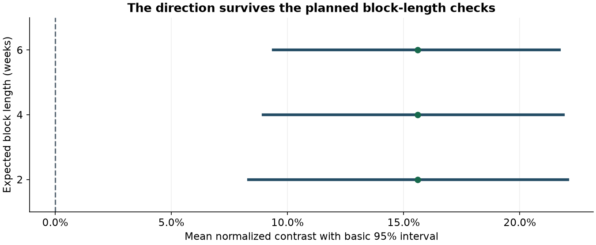

# Citi Bike: test the weekly-pattern hypothesis

Task 10 was implemented on **7 October 2026**, following acquisition and EDA.
The code, analysis and initial explanation were prepared with AI assistance at
Tomislav's request. Team review and individual human contributions remain to be
recorded. This continues the shared acquisition and exploration work.

## What we wanted to learn

Our proposed prediction task is: **can historical usage help predict the number
of recorded NYC Citi Bike rides starting on the next day?** Task 10 asks whether
there is an interpretable weekly association worth investigating in that forecast.

The specific question is: **within the same week, does average weekday usage
differ from average weekend usage?** We compare Monday-Friday with
Saturday-Sunday. We do not pick the two most different days after inspecting
their averages.

The development period had already been explored in task 9. This is therefore
**exploratory statistical evidence**, not an independently planned confirmation.
The [analysis plan](../citibike/hypothesis_plan.json) records the chosen contrast,
method and decision rule before running this analysis, but after that earlier EDA.

## The result

The analysis uses **38 complete Monday-Sunday weeks**, or **266 daily counts**,
from **2 January through 24 September 2023**. The incomplete edge weeks are left
out: 1 January and 25-30 September. There are no missing dates within the planned
January-September input period. October-December is unused in this calculation
and remains a candidate final-test period, pending the team's split decision.

| Measure | Result |
|---|---:|
| Average daily count on weekdays, across the included weeks | 100,784 rides |
| Average daily count on weekends, across the included weeks | 87,316 rides |
| Average paired weekday-minus-weekend gap | 13,467 rides/day |
| Weeks with a positive gap | 31 of 38 |
| Weeks with a negative gap | 7 of 38 |
| Average normalized within-week gap | 15.6% |
| Basic 95% bootstrap interval for that normalized mean | 8.9% to 21.9% |
| Approximate two-sided centered-bootstrap p-value | about 0.00005 |

**The 15.6% uses the whole-week daily mean as its denominator.** It does not
mean weekdays have 15.6% more rides than weekends. Each week is normalized
separately before taking the mean, so this is also different from dividing the
overall ride gap by an overall weekend average.



The interval excludes zero and remains positive in the planned sensitivity
checks. Under the method's assumptions, the data provide evidence against a
zero average contrast. This describes an association in these development data;
it does not establish the cause of the difference or a model's forecast accuracy.

## How the comparison works

For every complete week, define:

1. **W:** average count across the five weekdays.
2. **E:** average count across the two weekend days.
3. **A:** average count across all seven days.
4. **Ride gap:** `W - E`.
5. **Normalized contrast:** `(W - E) / A`.

For example, if every weekday has 100 rides and every weekend day has 80,
then `W = 100`, `E = 80` and `A = (5 × 100 + 2 × 80) / 7 = 94.29`.
The gap is 20 rides/day and the normalized contrast is approximately 21.2%.

We take the mean of the 38 weekly contrasts. Every complete week has equal
weight. This avoids giving a summer week a larger numerical effect merely
because its overall usage is much higher than a winter week's usage.
Comparing days inside the same week also reduces the influence of slow changes
in volume between weeks. It does not remove weather or holiday differences
inside a week.

The hypotheses are:

- **Null:** the mean normalized weekday-minus-weekend contrast is zero.
- **Alternative:** that mean differs from zero in either direction.

The test is two-sided, with a planned significance level of 0.05. Negative
weeks stay in the analysis. Millions of individual rides are not treated as
millions of independent observations: the comparison unit is a week, and
dependence between nearby weeks is allowed by the resampling method.

## Why uncertainty is estimated in blocks

Nearby periods can share conditions. Resampling individual days independently
would break those relationships. We use a **stationary bootstrap** of the
weekly contrasts: each simulated sequence starts at a random week, then either
continues to the next observed week or starts a new random run. The primary
restart probability is one quarter, giving an expected run length of four weeks.
Continuation wraps from the last week to the first when needed.

The method is described by [Politis and Romano (1994)](https://doi.org/10.1080/01621459.1994.10476870)
and the [official stationary-bootstrap documentation](https://bashtage.github.io/arch/bootstrap/generated/arch.bootstrap.StationaryBootstrap.html).
Our helper implements this resampling with NumPy; no additional dependency is
needed.

We generate **20,000 resampled sequences with seed 42** and calculate their
mean contrasts. The basic, or reverse-percentile, interval uses the simulated
errors around the observed mean. Specifically, if `q_low` and `q_high` are
the 2.5% and 97.5% quantiles of simulated means, its limits are
`2 × observed_mean - q_high` and `2 × observed_mean - q_low`.

For the approximate p-value, simulated errors are centered at zero to represent
the null. We count how many have an absolute magnitude at least as large as the
observed mean, then use `(extreme_count + 1) / (20,000 + 1)`. There were zero
such simulated extremes. The reported 0.00005 is the simulation's resolution
floor, **not an exact tail probability**. Reporting this conservatively as
approximately `p < 0.001` is sufficient here; reporting `p = 0` is incorrect.
The p-value is not the probability that the null hypothesis is true.

A 95% confidence interval describes the long-run coverage intended by this
procedure under its assumptions. It is not a 95% probability statement about
the fixed mean, and it is not an interval for tomorrow's ride count.

Four weeks is a documented working choice, not an optimally estimated run
length. We repeat the same analysis with two and six weeks, without selecting
the smallest p-value:

| Expected run length | Mean normalized gap | Basic 95% interval |
|---|---:|---:|
| 2 weeks | 15.6% | 8.3% to 22.1% |
| 4 weeks - primary | 15.6% | 8.9% to 21.9% |
| 6 weeks | 15.6% | 9.4% to 21.7% |



The direction is consistent across all three intervals. This sensitivity check
does not prove that every possible dependence pattern has been covered.

## What this means for the project

**Recommendation: continue the proposed next-day recorded citywide ride-count
forecast and include weekday/calendar information as a candidate feature.**
The calendar is known before the forecast date, so using it does not require
observing that day's rides.

This recommendation follows the recorded decision rule: the primary interval
excludes zero and its direction survives the planned run-length checks. It is
evidence that a calendar association exists in the development period, not
evidence that a particular model improves forecast error.

The next tasks remain:

- **Task 12:** fix chronological training, validation and final-test periods;
  choose the forecast horizon and metrics.
- **Task 14:** build and verify features using only information available before
  each forecast, including properly shifted ride counts.
- **Task 16:** compare a simple model with “same demand as last week,” using
  the same development dates. Calendar effects may already be captured by that
  naive comparator; this test does not guarantee an improvement over it.

The team still needs to agree the scope and accept the recommendation. No
forecast model or reserved-test performance was evaluated in task 10.

## Files and reproduction

| File | Purpose |
|---|---|
| [02_weekly_hypothesis.ipynb](../citibike/02_weekly_hypothesis.ipynb) | Executed explanation, calculations, tables and figures |
| [hypothesis_plan.json](../citibike/hypothesis_plan.json) | Hypotheses, period, contrast, bootstrap settings and decision rule |
| [citibike_hypothesis.py](../src/citibike_hypothesis.py) | Complete-week formation, resampling and result calculation |
| [hypothesis_results.json](../citibike/hypothesis_results.json) | Full numerical result and sensitivity checks |
| [weekly_contrasts.json](../citibike/weekly_contrasts.json) | All 38 weekly observations for inspection |

Use the project's verified Python 3.12 environment. Run acquisition and audit
notebooks 00 and 01 first, then run notebook 02 with the same kernel. The daily
CSV is recreated by acquisition and stays in ignored `data/processed/`.
Both notebook 02 and the helper command check it against the source manifest's SHA-256 fingerprint.
It uses the cached daily counts; this analysis does not need a new archive
download.

To recalculate the numerical results from PowerShell in the repository root:

```powershell
.\.venv\Scripts\python.exe src/citibike_hypothesis.py
```

Run notebook 02 to also recreate the figures and weekly observation snapshot.
Fixed seed and input fingerprints make the reported run reproducible. Changing
the plan creates a new analysis and should be explained in review.

## Checks and limitations

Verification covers a constructed known weekly effect, a zero-effect case,
scale invariance, rejection of missing/duplicate dates and invalid counts,
deterministic resampling, the expected continuation rate, and an independent
resampling standard-error check. Changing every October-December count leaves
the analysis unchanged. Saved results are compared with a fresh calculation;
the notebook executes without errors and the figures are visually checked.

The inference assumes the normalized contrasts are approximately stationary
with short-range dependence. There are only 38 weeks. Mean contrasts by the
quarter of the week's Monday are about 17.6%, 15.2% and 13.8%; these are
descriptive diagnostics, not extra hypothesis tests. A short sample cannot
establish stationarity, and the circular join between the last and first weeks
is an approximation. Longer dependence and structural changes remain possible.

Weather, holidays and the partial seasonal coverage limit interpretation.
Earlier EDA limits independent confirmation. The result concerns recorded
2023 usage under the audited source scope, not unmet demand, all future years,
or a causal weekday effect. The source-boundary and timestamp limitations
documented in [tasks 7 and 9](CITIBIKE_TASKS_7_9.md) still apply.

## How to explain it on Friday

“We compared weekday and weekend averages inside each complete week, then
normalized the gap to reduce the winter-to-summer volume change. Weekdays
were busier in 31 of 38 weeks, with an average gap of about 13,467 rides per
day. The normalized mean gap was 15.6% of the whole-week daily mean. Resampling
runs of nearby weeks gave a 95% interval of about 8.9% to 21.9%, and the
direction survived the planned run-length checks. That supports testing
calendar features in our next-day forecast; it does not establish forecast
accuracy. We kept October-December out of this analysis.”

Useful discussion points are whether this exploratory hypothesis and method
meet the assignment's expectations, whether the proposed forecasting scope is
appropriate, and how to fix chronological evaluation next. Read the notebook
and reproduce the calculation before presenting the work as understood.
