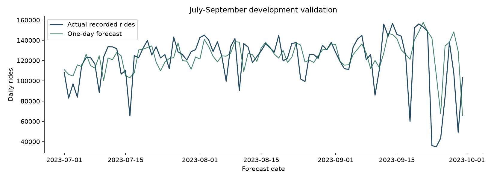

# Citi Bike forecasting - 9 October

**Owner: Tomislav Novosel, with AI assistance.** Human review and the AWS run are still needed. This continues tasks 7, 9 and 10 without changing the team's mushroom experiments.

## What are we predicting?

The total number of NYC Citi Bike rides starting on the next calendar day. We assume yesterday has finished and its count is available. This is a historical experiment, not a connection to live Citi Bike data or a forecast of available bikes at a station.

## Dates and preparation - tasks 12 and 14

| Part | Dates | Target days |
|---|---|---:|
| History only | 1-28 January 2023 | 0 |
| Training and tuning | 29 January-30 June | 153 |
| Development validation | 1 July-30 September | 92 |
| Reserved final test | 1 October-31 December | 92 |

The [evaluation plan](../citibike/evaluation_plan.json) fixes these choices. Tuning uses three expanding training folds, each followed by 21 validation days. There is no random shuffle. During the July-September check, the model stays fitted through June; each next-day prediction uses the actual counts available up to the previous day. This tests rolling one-day forecasts, not one forecast of all 92 days in advance.

Features include counts from 1, 2, 3, 7, 14, 21 and 28 days ago; averages over 3, 7, 14 and 28 previous days; recent variation and changes; weekday, yearly season and US federal holiday flags. A compact set has 10 features; the full set has 22. Same-day counts and future counts never become inputs. Ridge's scaler is fitted inside each training fold. The [preparation notebook](../citibike/03_data_preparation.ipynb) deliberately contains no plots.

Earlier EDA already examined January-September. These are development results and cannot serve as an independent confirmation. The final-test targets have not been used to train, select or score these models.

The small [development aggregate](../citibike/development_daily.csv) contains January-September only. Its SHA-256 and annual-source fingerprint are recorded alongside it. A fresh clone can reproduce modelling without downloading the approximately 2 GB trip archives; notebook 00 remains the source acquisition procedure.

## What worked - tasks 16, 19, 22 and 23

MAE means the average size of a mistake, in rides per day. Lower is better. All rows below use the same 92 validation dates.

| Model | MAE | RMSE |
|---|---:|---:|
| Same as last week | 18,477 | 28,230 |
| Average of the previous 7 days | 17,716 | 24,813 |
| Tuned seasonal average | 16,189 | 23,248 |
| Tuned Ridge | 17,850 | 23,119 |
| Tuned random forest | 15,007 | 23,229 |
| Tuned XGBoost | **14,693** | 23,426 |
| FLAML's selected model | 22,331 | 26,535 |


We actually ran FLAML AutoML: 80 trials across LightGBM, random forest, Extra Trees and XGBoost, using the same chronological training folds. It had a 180-second ceiling and reached the trial limit sooner. Its chosen configuration did worse on the later validation dates. Automated selection is useful, but its answer still needs checking.

The manual searches tried 28 Ridge configurations, 36 random forest configurations and **192 XGBoost configurations**. Each was checked on three chronological folds. BESTIJA's **RTX 5080** ran the XGBoost fits; the saved booster configuration confirms `cuda:0`. One GPU fit runs at a time. We also tuned nine seasonal-average configurations to give the learned models a stronger simple comparison.

The local candidate is XGBoost with depth 2, 100 trees, learning rate 0.03, minimum child weight 10, lambda 1 and full-row sampling. It learns a correction to last week's count. Column sampling is 0.9. This small configuration won the search; using more trees did not automatically improve it.

Its MAE is **20.5% lower than last week's count** and **9.2% lower than the stronger seasonal average**. These are observed development differences, not statistical proof that it will win next year. The forest's RMSE is slightly better, so the chosen primary metric matters. January-June tuning also preferred some configurations that were less successful later in summer.

## What the mistakes tell us - task 25

The model generally follows the weekly level, but sudden low-usage days cause large overestimates. On 23 September there were 36,069 rides; the model predicted about 142,278. Weather, disruptions or other events could be relevant, but these data do not establish the cause.



Keeping the XGBoost configuration fixed, the full feature set achieved MAE 14,693 versus 16,852 for the compact set. This supports keeping the larger set for this candidate. It does not identify which individual feature caused the difference. Error tables group mistakes by weekday and month and list the ten largest mistakes. Additional weather features would need forecasts available before the target day, rather than observed same-day weather.

## Notebooks and saved evidence

Read notebooks 03-10 in order: preparation, baselines, AutoML, Ridge, GPU XGBoost, random forest, errors and comparison. The actual training searches ran through the Python helpers. Saved notebook outputs review those experiment records by default; set `CITIBIKE_RETRAIN=1` or use the runner's `--train` flag to repeat training. Each manually trained family has its own notebook.

Reports under `reports/citibike/` include fold scores, every grid candidate, validation predictions, source hashes, package versions and feature checks. Models and raw data stay out of Git. The selected local configuration is checked in so a CPU machine can rebuild it.

```powershell
py -3.12 -m venv .venv
.\.venv\Scripts\python.exe -m pip install -r requirements-citibike.lock.txt
.\.venv\Scripts\python.exe scripts/rebuild_citibike_candidate.py
.\.venv\Scripts\python.exe -m unittest discover -s tests -p 'test_citibike*.py' -v
.\.venv\Scripts\python.exe scripts/run_citibike_notebooks.py
```

Use Python 3.12.10 for the recorded environment. To rerun all searches on BESTIJA:

```powershell
.\.venv\Scripts\python.exe scripts/run_citibike_notebooks.py --train
```

The last command requires a working CUDA GPU. CPU rebuilding uses the fixed selected configuration and measures its own validation score; it does not repeat the GPU search or assert bit-for-bit CPU/GPU equality.

On BESTIJA, a clean source copy rebuilt from the development snapshot, with no raw archives or existing model, achieved CPU MAE **14,761**. Its eight forecasting/API checks and the existing nine mushroom checks passed. The notebooks passed execution checks. Both local HTTP prediction paths, health and invalid-input responses passed. Browser automation and Docker were unavailable, so browser interaction and the container still need a teammate's check. See [the reproduction record](../reports/citibike/reproduction_check.json).

The local candidate is refitted on the 245 eligible January-September dates for the demo, with CPU inference. Its displayed validation score belongs to the earlier June training fit, not to predictions from the refitted model on its training data. AWS comparison and final selection remain open. After they are frozen, task 31 should evaluate October-December once. No final-test scoring script is run in this update.

## Explain it in class

- We turned many individual trips into one total for each day.
- Our simple guess is "use last week's count". Every model has to improve on that.
- We practise on earlier dates and check later dates because tomorrow cannot teach yesterday's model.
- The best local model corrects last week's count using recent patterns. Its typical validation mistake is about 14,700 rides, and some mistakes are much larger.
- AWS training, public hosting and final-test results are still pending. Ask the lecturer whether one AWS model overall is enough or whether both datasets need one.

Technical references: [chronological splits](https://scikit-learn.org/stable/modules/generated/sklearn.model_selection.TimeSeriesSplit.html), [XGBoost GPU training](https://xgboost.readthedocs.io/en/stable/gpu/), [FLAML's custom split support](https://microsoft.github.io/FLAML/docs/reference/automl/automl/).
